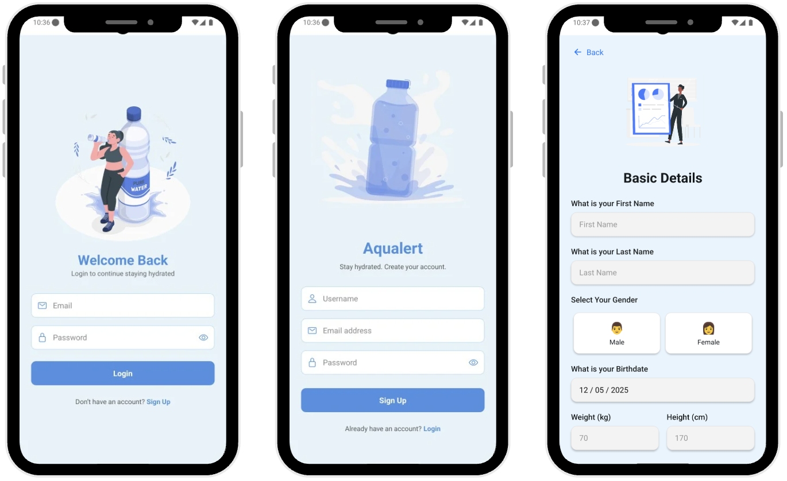
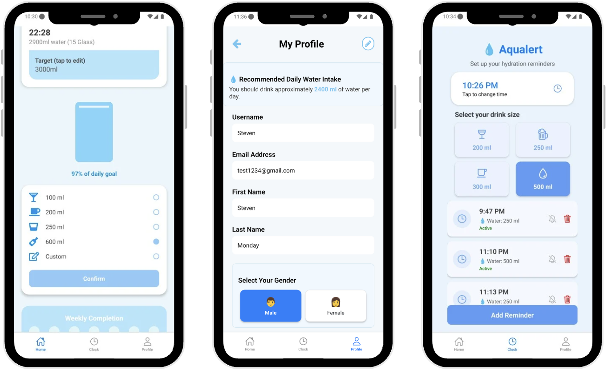

# 💧 Aqualert

**Aqualert** is a mobile app that helps users stay hydrated by tracking their water intake, setting daily goals, and sending reminders. It consists of a **Node.js backend** and a **React Native frontend (Android)**.


## Overview

People often forget to drink enough water daily, leading to dehydration and related health issues. Aqualert addresses this problem by:

- Letting users set personalized hydration goals
- Sending timely notifications to remind users to drink
- Providing a clean interface for manual water intake logging
- Offering visual insights into daily and weekly water consumption


## Features

- User Authentication (JWT)
- Drink water reminder notifications
- Set daily water intake goals
- Track water intake history (daily & weekly)


## Tech Stack

### Backend (Node.js + Express)
- MongoDB (via Mongoose)
- JWT-based Authentication

### Frontend (React Native for Android)
- AsyncStorage for token storage
- Notification API (e.g., Expo or PushNotification)


## Setup Instructions

### Backend (Node.js)

1. Navigate to the backend folder:

```bash
cd backend
```

2. Install dependencies:

```bash
npm install
```

3. Create a `.env` file in the backend folder:

```env
PORT=3000
MONGO_URI=your_mongodb_uri_here
JWT_SECRET=your_jwt_secret_here
```

To generate a secret key for JWT_SECRET, run:
```bash
node -e "console.log(require('crypto').randomBytes(64).toString('hex'))"
```

4. Start the server:

```bash
npm run dev
```

The backend will be available at: `http://localhost:3000/api`


### Frontend (React Native - Android)

1. Navigate to the mobile folder:

```bash
cd mobile
```

2. Install dependencies:

```bash
npm install
```

3. Set up Android SDK path:

Edit `android/local.properties`:

```properties
sdk.dir=/Users/YOUR_USERNAME/Library/Android/sdk
```

4. Configure API URL in `constants/api.js`:

```js
// For deployed backend (Onrender):
export const API_URL = "https://aqualert.onrender.com/api";

// For local development on a physical device (replace with your IP address):
export const API_URL = "http://192.168.x.xx:3000/api";

// For emulator (if using localhost with forwarding):
export const API_URL = "http://localhost:3000/api";
```

5. Run the app on Android:

```bash
npx expo
```
For more frontend setup details, see [mobile/README.md](mobile/README.md).


Ensure your Android emulator or physical device is running and connected to the same network if testing against a local server.


### Project Structure Expected:
```
.
├── README.md
├── backend
│   ├── .env                       
│   └── ...
├── mobile
│   ├── android
│   │   ├── local.properties       
│   │   └── ...
│   ├── constants
│   │   └── api.js                
│   └── ...
└── package-lock.json
```

## App Preview




